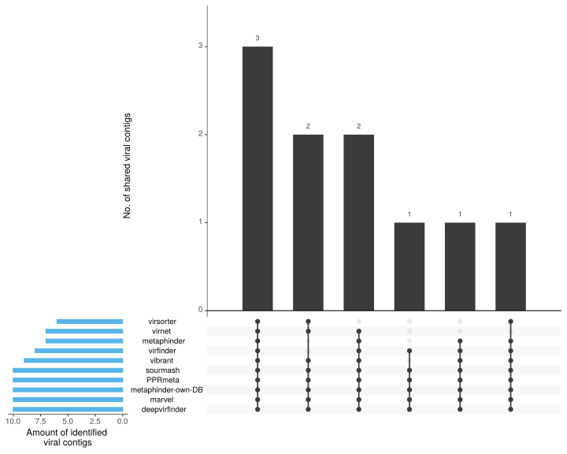

[](https://www.biorxiv.org/content/10.1101/2020.07.24.219899v1)

[](https://twitter.com/gcloudChris) 
[](https://twitter.com/mult1fractal) 

# What the Phage (WtP)

* by Christian Brandt & Mike Marquet
* **this tool is under active development,feel free to report issues and add suggestions**
* Use a release candidate for a stable experience via `-r` e.g. `-r v0.9.0`
  * These are extensively tested release versions of WtP
  * [releases of WtP are here](https://github.com/replikation/What_the_Phage/releases)


## Preprint:

> **What the Phage: A scalable workflow for the identification and analysis of phage sequences**
>
> M. Marquet, M. Hölzer, M. W. Pletz, A. Viehweger, O. Makarewicz, R. Ehricht, C. Brandt
>
> doi: https://doi.org/10.1101/2020.07.24.219899


# Table of contents

* [What is this Repo?](#What-is-this-Repo)
* [Installation](#Installation)
  * [Quick installation](#Quick-installation)
  * [Default](#Default)
* [Execution / Examples / Help](#Execution-/-Examples-/-Help)
  * [Quick execution](#Quick-execution)
  * [Advanced execution](#Advanced-execution)
    * [Inputs](#Inputs)
    * [Workflow control](#Workflow-control)
    * [Profiles](#Profiles)
    * [Data Handling](#Data-handling)
    * [Pre-download for offline-mode](#Pre-download-for-offline-mode)
* [Results / Examples](#Example-/-results)
* [Under the hood](#Under-the-hood)
* [Included bioinformatic tools](#Included-bioinformatic-tools)


# What is this repo

#### TL;DR
* WtP is a scalable and easy-to-use workflow for phage identification and analysis. Our tool currently combines 10 established phage [identification tools](#included-bioinformatic-tools)
* An attempt to streamline the usage of various phage identification and prediction tools
* The main focus is stability and data filtering/analysis for the user
* The tool is intended for fasta and fastq reads to identify phages in contigs/reads
* Proper prophage detection is not implemented (yet) - but a handful of tools report them - so they are mostly identified


# Installation

## Quick installation

* "None informaticians / newcomer to bioinformatics" approach using ubuntu [admin rights required]
* Copy and paste for local, docker usage

```bash
sudo apt-get update
sudo apt install -y default-jre
curl -s https://get.nextflow.io | bash 
sudo mv nextflow /usr/bin/
sudo apt-get install -y docker-ce docker-ce-cli containerd.io
sudo usermod -a -G docker $USER
```
* Restart your computer and [go](#Quick-execution)


## Default

### Dependencies
> * [Nextflow installation](https://www.nextflow.io/) + java runtime
>   * move or add the nextflow executable to a bin path
> * git (should be already installed)
> * wget (should be already installed)
> * tar (should be already installed)

* Choose one:

>  * [Docker installation](https://docs.docker.com/v17.09/engine/installation/linux/docker-ce/ubuntu/#install-docker-ce)
>    * add docker to your User group via `sudo usermod -a -G docker $USER`
>  * [Singularity installation](https://github.com/sylabs/singularity/blob/master/INSTALL.md)
* Restart your computer
* Try out the installation by entering the following (analyses 1 sample with 10 phage sequences ~ 30 min runtime):

```shell
# for docker (local use)
nextflow run replikation/What_the_Phage -r v0.9.0 --cores 8 -profile smalltest,local,docker

# for singularity (slurm use)
nextflow run replikation/What_the_Phage -r v0.9.0 --cores 8 -profile smalltest,slurm,singularity
```

# Execution / Examples / Help

## Call help via "--help"

```bash
nextflow run replikation/What_the_Phage -r v0.9.0 --help
```


## Quick execution

* Just give me the command god dammit.....

```bash
nextflow run \                    # calling the workflow
  replikation/What_the_Phage \    # WtP Git-Repo
  --fasta /path/to/file.fa \      # provide a fasta-file as input
  --cores 8 \                     # number of cores you want to use
  -profile local,docker           # choose the environment:local and docker
  -r v0.9.0                       # WtP release version
```

## Advanced execution

### Advanced execution command

* The following command will run WtP using
  * ... all `fasta` files found in the `/path/to` directory.
  * ... a `local` host (the machine where it is launched) and `docker` containers for handling software dependencies.
  * ... 20 cores for parallel execution.
  * ... release `0.9.0` of the worfklow.
  * ... identification only - no annotation.
  * ... and excluding `deepvirfinder`, `virfinder` and `marvel` from the list of tools.

```shell
nextflow run replikation/What_the_Phage \ 
  --fasta '/path/to/*.fasta' \ 
  -profile local,docker \
  --cores 20 \
  -r v0.9.0 \
  --anno \
  --dv \
  --vf \
  --ma
```
* The order of flags does not matter


### Inputs

* Input examples:
  * wildcards need single quotes around the path (`'`)

```bash
--fasta /path/to/phage-assembly.fa  # path to your fasta-file
--fasta '/path/to/*.fa'             # path to all .fa files in a dir
--fastq /path/to/phage-read.fastq   # path to your fastq-file
--fastq '/path/to/*.fastq'          # path to all .fastq files in a dir
```

### Workflow control

* Turn on/off tools (check `--help` for more)

```bash
    --dv             #   deactivates deepvirfinder
    --ma             #   deactivates marvel
    --mp             #   deactivates metaphinder
    --pp             #   deactivates PPRmeta
    --sm             #   deactivates sourmash
    --vb             #   deactivates vibrant
    --vf             #   deactivates virfinder
    --vn             #   deactivates virnet
    --vs             #   deactivates virsorter
    --ph             #   deactivates phigaro
	--sk             #   deactivates seeker
    --identify       #   only phage identification, skips analysis
    --annotate       #   only annotation, skips phage identification
```

* Set the minimum size of contigs for identification

```bash
--filter         #   min contig size [bp] to analyse [default: 1500]
```


### Profiles

1. Choose the environment: `local`, `slurm`, `lsf` or `ebi`
2. Choose the engine: `docker` or `singularity`

Examples:

```bash
-profile local,docker
-profile local,singularity
-profile lsf,docker
```


### Release candidate
* A release candidate is a [released version of WtP](https://github.com/replikation/What_the_Phage/releases) which ensures proper functionality
* Version control ensures reproducibility as each tools version is also "locked" within the release candidate
  * Databases have no automatic version control (they are downloaded from the source)
  > If you need version control for databases, just make a copy of the database dir after download
  > you can specify the database directory via the `--database` flag (see below)
    * WtP only downloads a database if it's missing. It is **not** "auto-updating" them
* A release can be specified in the command line, using the `-r` flag. For example:

```bash
-r v0.8.0
```


### Data handling

* WtP handles everything by default
* If you need to change paths use the following commands
  * It's useful to set the parameter `--workdir` to your current working directory if `/tmp` (default) has limited space.

```bash
--workdir /path/to/dir    # defines the path where nextflow writes temporary files, default: '/tmp/nextflow-phage-$USER'
--databases /path/to/dir   # specify download location of databases, default './nextflow-autodownload-databases'
--cachedir /path/to/dir   # defines the path where singularity images are cached, default './singularity-images'
--output results          # path of the outdir, default './results'
```

### Pre-download for offline-mode

* The flag `--setup` skips analysis and just downloads all databases and containers
* Needs roughly 30 GB storage for databases, excluding programs

```bash
nextflow run replikation/What_the_Phage --setup -r v0.8.0
```

* You can specify the location where all databases are stored, by providing a location with the `--databases` parameter.
* Make sure that you specify the database location when executing WtP, if you change the default path.
* Singularity images sometimes fail during building, just try to re-execute with `--setup`.
  * WtP attempts to build images up to 3 times, image building is individually skipped if present.


# Example results
#### 1.  Identification Tool and contig overview (UpSetR)



*Figure 1:* This chart (UpSetR plot) quantifies the result-intersections of the phage identification tools, similar to a Venn diagram. 
The number of positive phage-sequences identified by each tool is represented on the left barplot in blue.
The dot plot shows via line connection(s) which of the tools identified the exact same positive phage sequences. 
The amount of these shared matches is quantified as a barplot above each corresponding dot pattern.


#### 2. Annotation Visualization (Chromomap) 
* [Chromomap results](https://replikation.github.io/What_the_Phage/index.html)

*See Link:* The graphical output of the annotation shows an overview of the individual loci of the predicted ORFs and the corresponding genes in the fasta sequences identified as phages.
For better visibility, we have chosen 4 categories: tail, capsid, baseplate and other.
This output can be used to verify the identified sequences (if the predicted sequences make sense or not).
The annotation results are additionally plotted in an interactive HTML-file and are available as a file for further analysis.


#### 3. Summary Table (checkV + Results)

* Check [CheckV](https://bitbucket.org/berkeleylab/checkv/src/master/) for a detailed explanation.

contig_id|	contig_length|	genome_copies|	gene_count|	viral_genes|	host_genes|	checkv_quality|	miuvig_quality|	completeness|	completeness_method|	contamination|	provirus|
|-|-|-|-|-|-|-|-|-|-|-|-|
pos_phage_0|	146647|	1|	243|	141|	1|	High-quality|	High-quality|	97.03|	AAI-based|	0|	No|
pos_phage_1|	58871|	1|	97|	21|	0|	High-quality|	High-quality|	100|	AAI-based|	0|	No|
pos_phage_2|	58560|	1|	95|	20|	0|	High-quality|	High-quality|	99.47|	AAI-based|	0|	No|
pos_phage_3|	59443|	1|	90|	52|	0|	High-quality|	High-quality|	100|	AAI-based|	0|	No|
pos_phage_4|	51290|	1|	74|	44|	0|	High-quality|	High-quality|	100|	AAI-based|	0|	No|
pos_phage_5|	43293|	1|	69|	55|	0|	High-quality|	High-quality|	100|	AAI-based|	0|	No|
pos_phage_6|	43851|	1|	53|	30|	0|	High-quality|	High-quality|	98.71|	AAI-based|	0|	No|
pos_phage_7|	44262|	1|	54|	31|	0|	High-quality|	High-quality|	99.64|	AAI-based|	0|	No|
pos_phage_8|	41865|	1|	60|	57|	0|	High-quality|	High-quality|	97.29|	AAI-based|	0|	No|
pos_phage_9|	221908|	1|	310|	48|	9|	High-quality|	High-quality|	100|	AAI-based|	0|	No|


# Under the hood


*Figure 3:* This plot shows a simplified dag-chart of WtP for better understanding of what's going on behind the curtain.


# Included bioinformatic tools

* Please cite the following tools


### Identification

Toolname/Gitlink | Reference |
|-|-|
[MARVEL](https://github.com/LaboratorioBioinformatica/MARVEL#metagenomic-analysis-and-retrieval-of-viral-elements)|[MARVEL, a Tool for Prediction of Bacteriophage Sequences in Metagenomic Bins](https://www.frontiersin.org/articles/10.3389/fgene.2018.00304/full)
[VirFinder](https://github.com/jessieren/VirFinder)|[VirFinder: R package for identifying viral sequences from metagenomic data using sequence signatures](https://link.springer.com/epdf/10.1186/s40168-017-0283-5?)
[PPR-Meta](https://github.com/zhenchengfang/PPR-Meta)|[PPR-Meta: a tool for identifying phages and plasmids from metagenomic fragments using deep learning](https://www.ncbi.nlm.nih.gov/pmc/articles/PMC6586199/)
[VirSorter](https://github.com/simroux/VirSorter)|[VirSorter: mining viral signal from microbial genomic data](https://peerj.com/articles/985/)
[MetaPhinder](https://github.com/vanessajurtz/MetaPhinder)|[MetaPhinder—Identifying Bacteriophage Sequences in Metagenomic Data Sets](https://journals.plos.org/plosone/article?id=10.1371/journal.pone.0163111)
[DeepVirFinder](https://github.com/jessieren/DeepVirFinder)|[Identifying viruses from metagenomic data by deep learning](https://arxiv.org/abs/1806.07810)
[Sourmash](https://github.com/dib-lab/sourmash)|[sourmash: a library for MinHash sketching of DNA](https://joss.theoj.org/papers/10.21105/joss.00027)|
[VIBRANT](https://github.com/AnantharamanLab/VIBRANT)|[Automated recovery, annotation and curation of microbial viruses, and evaluation of virome function from genomic sequences](https://www.biorxiv.org/content/biorxiv/early/2019/11/26/855387.full.pdf)
[VirNet](https://github.com/alyosama/virnet)|[Deep attention model for viral reads identification](https://ieeexplore.ieee.org/document/8639400)
[Phigaro](https://github.com/bobeobibo/phigaro)| [Phigaro: high throughput prophage sequence annotation](https://www.biorxiv.org/content/10.1101/598243v1)
[Virsorter2 beta](https://github.com/jiarong/VirSorter2)|
[Seeker](https://github.com/gussow/seeker)|[Seeker: alignment-free identification of bacteriophage genomes by deep learning](https://doi.org/10.1093/nar/gkaa856)|
 
 
### Annotation & classification

Toolname/Git | Reference
|-|-|
[prodigal](https://github.com/hyattpd/Prodigal)|[Prodigal: prokaryotic gene recognition and translation initiation site identification](https://bmcbioinformatics.biomedcentral.com/articles/10.1186/1471-2105-11-119)
[hmmer](http://hmmer.org/)|[nhmmer: DNA homology search with profile HMMs](https://academic.oup.com/bioinformatics/article/29/19/2487/186765)
[chromomap](https://cran.r-project.org/web/packages/chromoMap/vignettes/chromoMap.html)|
[CheckV](https://bitbucket.org/berkeleylab/checkv/src/master/)|[CheckV: assessing the quality of metagenome-assembled viral genomes](https://www.biorxiv.org/content/10.1101/2020.05.06.081778v1)


### Other tools

Toolname/Git | Reference
|-|-|
[samtools](https://github.com/samtools/samtools)|[The Sequence Alignment/Map format and SAMtools](https://www.ncbi.nlm.nih.gov/pmc/articles/PMC2723002/)
[seqkit](https://github.com/shenwei356/seqkit)|[SeqKit: A Cross-Platform and Ultrafast Toolkit for FASTA/Q File Manipulation](https://ieeexplore.ieee.org/document/8639400)
[UpSetR](https://github.com/hms-dbmi/UpSetR)|[UpSetR: an R package for the visualization of intersecting sets and their properties](https://doi.org/10.1093/bioinformatics/btx364)

