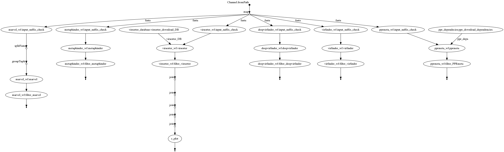
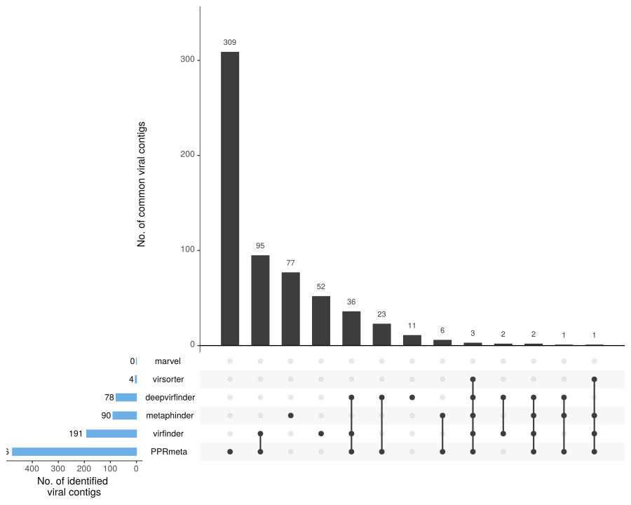

# What the Phage (WtP)


[](https://twitter.com/gcloudChris) 

* by Christian Brandt & Mike Marquet
* **this tool is currently under heavy development, so expect some bugs but feel free to report issues**

## What is this Repo?

* an attempt to streamline the usage of various phage identification and prediction tools
* the main focus is stability an data filtering / analysis for the user
* the tool is intended for fasta and nanopore fastq reads to identify phages in contigs/reads
* prophage detection is not implemented

## The following Phage-Tools are currently included

* [MARVEL Metagenomic Analysis and Retrieval of Viral Elements](https://github.com/LaboratorioBioinformatica/MARVEL#metagenomic-analysis-and-retrieval-of-viral-elements)
  * [paper](https://www.frontiersin.org/articles/10.3389/fgene.2018.00304/full)
* [VirFinder: R package for identifying viral sequences from metagenomic data using sequence signatures](https://github.com/jessieren/VirFinder)
  * [paper](https://link.springer.com/epdf/10.1186/s40168-017-0283-5?)
* [PPR-Meta: a tool for identifying phages and plasmids from metagenomic fragments using deep learning](https://github.com/zhenchengfang/PPR-Meta)
  * [paper](https://www.ncbi.nlm.nih.gov/pmc/articles/PMC6586199/)
* [VirSorter](https://github.com/simroux/VirSorter)
  * [paper](https://peerj.com/articles/985/)
* [MetaPhinder](https://github.com/vanessajurtz/MetaPhinder)
  * [paper](https://journals.plos.org/plosone/article?id=10.1371/journal.pone.0163111)
* [DeepVirFinder](https://github.com/jessieren/DeepVirFinder)
  * [paper](https://arxiv.org/abs/1806.07810)
* [Sourmash](https://github.com/dib-lab/sourmash)
  * [paper](https://joss.theoj.org/papers/10.21105/joss.00027)
* [VIBRANT](https://github.com/AnantharamanLab/VIBRANT)
  * [paper](https://www.biorxiv.org/content/biorxiv/early/2019/11/26/855387.full.pdf)
* [VirNet](https://github.com/alyosama/virnet)
  * [paper](https://ieeexplore.ieee.org/document/8639400)

## Workflow



## Installation

* WtP runs with the workflow manager `nextflow` using `docker`
* this means all the other programs are automatically pulled via docker
* Only `docker` and `nextflow` needs to be installed

### Easy Installation
* if you dont have experience with bioinformatic tools use this
* just copy the commands into your terminal to set everything up

```bash
sudo apt-get update
sudo apt install -y default-jre
curl -s https://get.nextflow.io | bash 
sudo mv nextflow /bin/
sudo apt-get install -y docker-ce docker-ce-cli containerd.io
sudo usermod -a -G docker $USER
```

* restart your computer

* try out the installation by entering the following

```bash
nextflow run replikation/What_the_Phage -r v0.2 --fasta ~/.nextflow/assets/replikation/What_the_Phage/test-data/T7_draft.fa
```

### Normal Installation

* this is the default choice

**Dependencies**

>   * docker (add docker to your Usergroup, so no sudo is needed)
>   * nextflow + java runtime 
>   * git (should be already installed)
>   * wget (should be already installed)
>   * tar (should be already installed)

* Docker installation [here](https://docs.docker.com/v17.09/engine/installation/linux/docker-ce/ubuntu/#install-docker-ce)
* Nextflow installation [here](https://www.nextflow.io/)
* move or add the nextflow executable to a bin path
* add docker to your User group via `sudo usermod -a -G docker $USER`


## Execution

* for local use of the `master` branch you could either clone the git and do:

```bash
./phage.nf --fasta 'test-data/*.fasta'
```

* or execute it directly via a release candidate ( `-r releasenumber` , e.g. `-r v0.2`)

```bash
nextflow run replikation/What_the_Phage -r v0.2 --fasta 'your-fasta-files/*.fasta'
# or
nextflow run replikation/What_the_Phage -r v0.2 --fasta your-file.fasta
```

* long-read input is supported via `--fastq`

### Tool control

* all the analysis tools included can be separatly turned via adding the option flags
* do `nextflow run replikation/What_the_Phage -r v0.2 --help` for all options

```bash
# in this case Marvel (ma) and deepvirfinder (dv) are deactivated
nextflow run replikation/What_the_Phage -r v0.2 --fasta your-file.fasta --dv --ma
```


## Results

* example output:



## Help

```bash
nextflow run replikation/What_the_Phage --help
# or
./phage.nf --help
```
