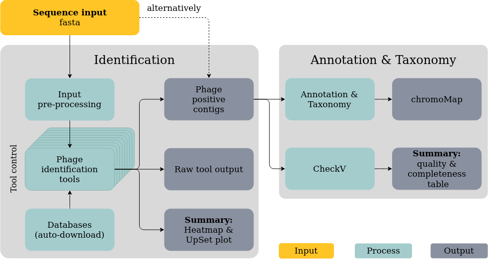

[](https://twitter.com/gcloudChris) 
[](https://twitter.com/mult1fractal) 

# What the Phage (WtP)
* by Christian Brandt & Mike Marquet
* **this tool is currently under heavy development, so expect some bugs but feel free to report issues**
* a save bet is to use release or pre-release candidates via `-r release number` e.g. `-r v0.6`
  * these are tested versions of WtP

# Table of content


* [What is this Repo?](#What-is-this-Repo)
* [Installation](#Installation)
  * [Quick installation](#Quick-installation)
  * [Default](#Default)
* [Execution / Examples / Help](#Execution-/-Examples-/-Help)
  * [Quick execution](#Quick-execution)
  * [Advanced execution](#Advanced-execution)
    * [Inputs](#Inputs)
    * [Workflow control](#Workflow-control)
    * [Profiles](#Profiles)
    * [Data Handling](#Data-handling)
    * [Pre-download for Offline-mode](#Pre-download-for-Offline-mode)
* [Results / Examples](#Example-/-results)
* [Under the hood](#Under-the-hood)
* [Included bioinformatic tools](#Included-bioinformatic-tools)


# What is this repo

#### TL;DR
* WtP is a scalable and easy-to-use workflow for phage identification and analysis. Our tool currently combines  9 established phage [identification tools](#included-bioinformatic-tools)
* An attempt to streamline the usage of various phage identification and prediction tools
* The main focus is stability and data filtering/analysis for the user
* The tool is intended for fasta and fastq reads to identify phages in contigs/reads
* Prophage detection is not implemented (yet)


# Installation

## Quick installation

* "None informaticians / newcomer to bioinformatics" approach using ubuntu [admin rights required]
* Copy and paste for local, docker usage

```bash
sudo apt-get update
sudo apt install -y default-jre
curl -s https://get.nextflow.io | bash 
sudo mv nextflow /usr/bin/
sudo apt-get install -y docker-ce docker-ce-cli containerd.io
sudo usermod -a -G docker $USER
```
* Restart your computer and [go](##Quick-execution)


## Default

### Dependencies
> * [Nextflow installation](https://www.nextflow.io/) + java runtime
>   * move or add the nextflow executable to a bin path
> * git (should be already installed)
> * wget (should be already installed)
> * tar (should be already installed)

* Choose one:
> * [Docker installation](https://docs.docker.com/v17.09/engine/installation/linux/docker-ce/ubuntu/#install-docker-ce)
>   * add docker to your User group via `sudo usermod -a -G docker $USER`
>  * [Singularity installation](https://github.com/sylabs/singularity/blob/master/INSTALL.md)
* Restart your computer
* Try out the installation by entering the following
```shell
nextflow run replikation/What_the_Phage -r v0.6 --fasta ~/.nextflow/assets/replikation/What_the_Phage/test-data/all_pos_phage.fasta -profile local,docker
```

# Execution / Examples / Help

## Call help via "--help"
```bash
nextflow run replikation/What_the_Phage --help
```


## Quick execution
* Just give me the command god dammit.....

```bash
nextflow run \                  # calling the workflow
replikation/What_the_Phage \    # WtP Git-Repo
--fasta /path/to/file.fa \      # provide a fasta-file as input
--cores 4 \                     # [number of cores you want to use]
-profile local,docker           # choose the environment:local and docker
-r v0.6                         # WtP release version
```


## Advanced execution

### Advanced execution command
* e.g.:


```shell
nextflow run replikation/What_the_Phage \ 
--fasta /path/to/file.fa \ 
-profile local,docker \
--cores 4 \
-r v0.6 \
--anno \
--dv \
--vf \
--ma
```
* The order of flags can be random

### Inputs
* Choose your input-file:
```bash
--fasta /path/to/phage-assembly.fa  # path to your fasta-file
--fasta '/path/to/*.fa'             # path to all .fa files in a dir
--fastq /path/to/phage-read.fastq   # path to your fastq-file
--fastq '/path/to/*.fastq'          # path to all .fastq files in a dir
```

### Workflow control
* Turn on/off tools 

```bash
    --dv             #   deactivates deepvirfinder
    --ma             #   deactivates marvel
    --mp             #   deactivates metaphinder
    --pp             #   deactivates PPRmeta
    --sm             #   deactivates sourmash
    --vb             #   deactivates vibrant
    --vf             #   deactivates virfinder
    --vn             #   deactivates virnet
    --vs             #   deactivates virsorter
    --anno           #   skips annotation
    --filter         #   min contig size [bp] to analyse
```

### Profiles
* Choose the environment: cloud or local use or docker or singularity
```shell
-profile local,docker
-profile local,singularity
-profile lsf,docker
```

### Release candidate
* A release candidate is a [released version of WtP](https://github.com/replikation/What_the_Phage/releases) which ensures proper functionality of WtP
```bash
-r v0.6
```

### Data handling

* WtP handles everything by default.
* If you want to change the location use the following commands
  * It's useful to specify `--workdir` to your current working dir
```bash
--workdir /path/to/dir    # defines the path where nextflow writes temporary files, by default this is `/tmp/nextflow-phage-$USER`
--database /path/to/dir   # specify download location of databases
--cachedir /path/to/dir   # defines the path where singularity images are cached
--output /path/to/output  # by default, your current working dir
```


### Pre-download for Offline-mode

* Skips analysis and just downloads databases and containers
* Needs roughly 30 GB as storage
* Clone the Git-Repo: `git clone https://github.com/replikation/What_the_Phage.git`

```bash
nextflow run replikation/What_the_Phage --setup
```
* Everything has been pre-downloaded and you can use the following command in the Git-Repo without an internet connection:
```shell
nextflow run replikation/What_the_Phage.nf \
--fasta 'test-data/*.fasta' \
-profile local,docker \
-r v0.6 \
--cores 4
```

* Refer to the pre-downloaded databases when using this method (--database)

# Example results
#### 1.  Identification Tool and contig overview (UpSetR)


*Figure 1:* This chart (UpSetR plot) quantifies the result-intersections of the phage identification tools, similar to a venn diagram. The amount of positive phage-sequences identified by each tool is represented on the left barplot in blue. The dot plot shows via line connection(s) which of the tools identified the exact same positive phage sequences. The amount of these shared matches is quantified as a barplot above each corresponding dot pattern.

#### 2. Annotation Visualization (Chromomap) 
* [chromomap results](https://replikation.github.io/What_the_Phage/index.html)

*See Link:* The graphical output of the annotation shows an overview of the individual loci of the predicted ORFs and the corresponding genes in the fasta sequences identified as phages. For better visibility, we have chosen 4 categories tail, capsid, baseplate, and other. This output can be used to verify the identified sequences (if the predicted sequences make sense or not). The annotation results are additionally plotted in an interactive HTML-file and are available as a file for further analysis.

#### 3. Summary Table (checkV + Results)
* Featured for release `-r v0.7` (wip)

# Under the hood



*Figure 3:* This plot shows a simplified dagchart of WtP for better understanding what's going on behind the curtain.


# Included bioinformatic tools
* Please cite the following tools


### Identification
Toolname/Gitlink | Reference |  
|-|-|
[MARVEL](https://github.com/LaboratorioBioinformatica/MARVEL#metagenomic-analysis-and-retrieval-of-viral-elements)|[MARVEL, a Tool for Prediction of Bacteriophage Sequences in Metagenomic Bins](https://www.frontiersin.org/articles/10.3389/fgene.2018.00304/full)
[VirFinder](https://github.com/jessieren/VirFinder)|[VirFinder: R package for identifying viral sequences from metagenomic data using sequence signatures](https://link.springer.com/epdf/10.1186/s40168-017-0283-5?)
[PPR-Meta](https://github.com/zhenchengfang/PPR-Meta)|[PPR-Meta: a tool for identifying phages and plasmids from metagenomic fragments using deep learning](https://www.ncbi.nlm.nih.gov/pmc/articles/PMC6586199/)
[VirSorter](https://github.com/simroux/VirSorter)|[VirSorter: mining viral signal from microbial genomic data](https://peerj.com/articles/985/)
[MetaPhinder](https://github.com/vanessajurtz/MetaPhinder)|[MetaPhinder—Identifying Bacteriophage Sequences in Metagenomic Data Sets](https://journals.plos.org/plosone/article?id=10.1371/journal.pone.0163111)
[DeepVirFinder](https://github.com/jessieren/DeepVirFinder)|[Identifying viruses from metagenomic data by deep learning](https://arxiv.org/abs/1806.07810)
[Sourmash](https://github.com/dib-lab/sourmash)|[sourmash: a library for MinHash sketching of DNA](https://joss.theoj.org/papers/10.21105/joss.00027)|
[VIBRANT](https://github.com/AnantharamanLab/VIBRANT)|[Automated recovery, annotation and curation of microbial viruses, and evaluation of virome function from genomic sequences](https://www.biorxiv.org/content/biorxiv/early/2019/11/26/855387.full.pdf)
[VirNet](https://github.com/alyosama/virnet)|[Deep attention model for viral reads identification](https://ieeexplore.ieee.org/document/8639400)

 
 
### Annotation & classification
Toolname/Git | Reference
|-|-|
[prodigal](https://github.com/hyattpd/Prodigal)|[Prodigal: prokaryotic gene recognition and translation initiation site identification](https://bmcbioinformatics.biomedcentral.com/articles/10.1186/1471-2105-11-119)
[hmmer](http://hmmer.org/)|[nhmmer: DNA homology search with profile HMMs](https://academic.oup.com/bioinformatics/article/29/19/2487/186765)
[chromomap](https://cran.r-project.org/web/packages/chromoMap/vignettes/chromoMap.html)|

### Other tools
Toolname/Git | Reference
|-|-|
[samtools](https://github.com/samtools/samtools)|[The Sequence Alignment/Map format and SAMtools](https://www.ncbi.nlm.nih.gov/pmc/articles/PMC2723002/)
[seqkit](https://github.com/shenwei356/seqkit)|[SeqKit: A Cross-Platform and Ultrafast Toolkit for FASTA/Q File Manipulation](https://ieeexplore.ieee.org/document/8639400)
[UpSetR](https://github.com/hms-dbmi/UpSetR)|

